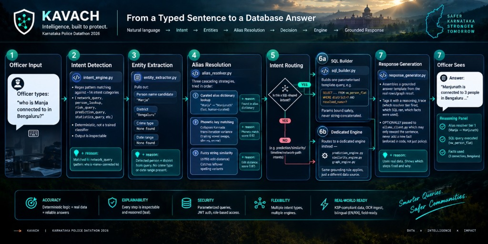
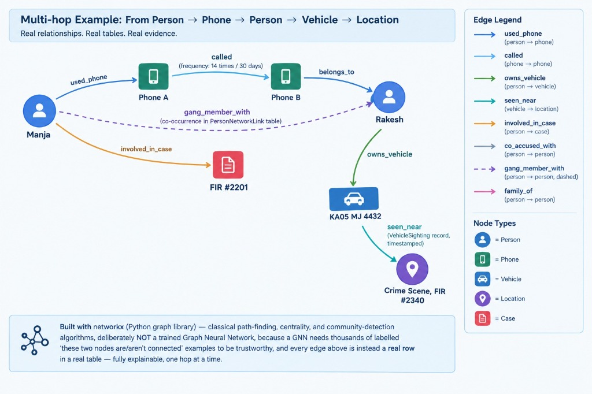
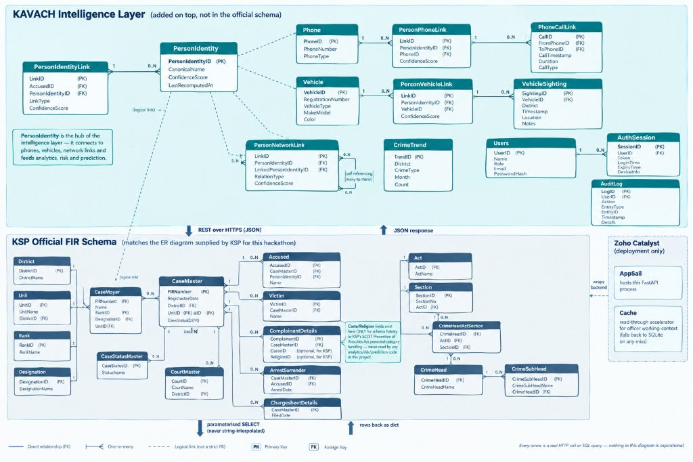
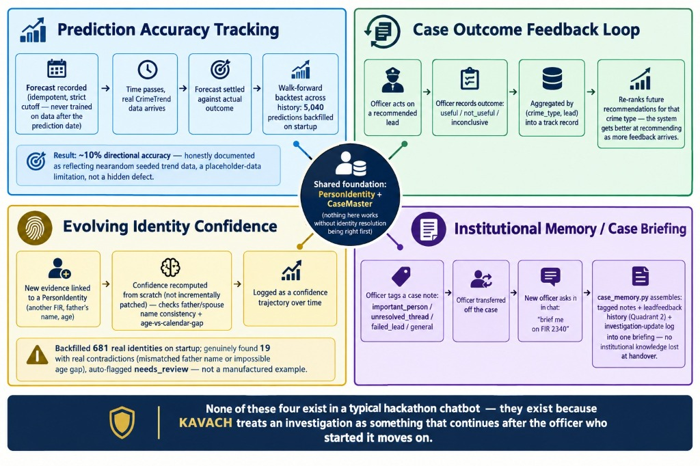
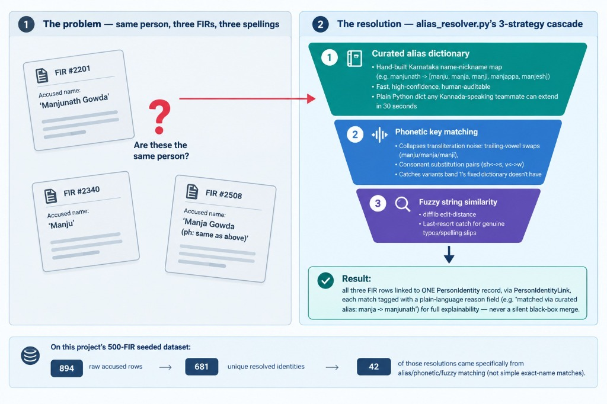
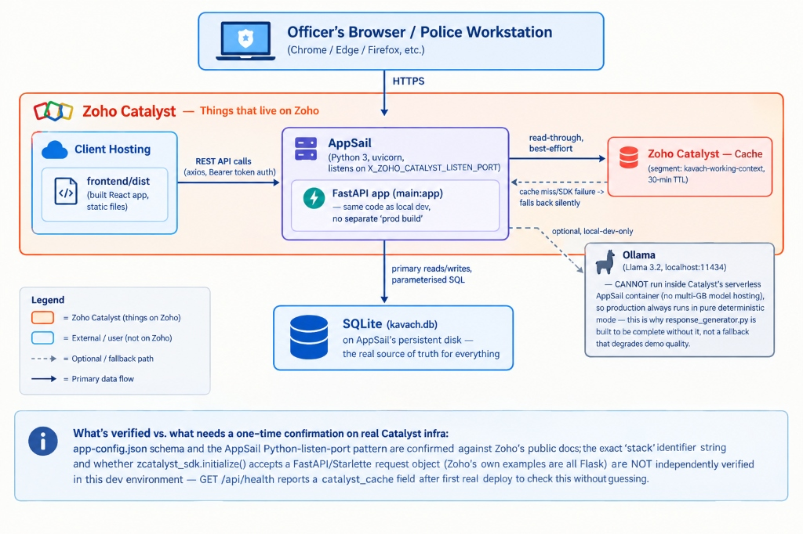
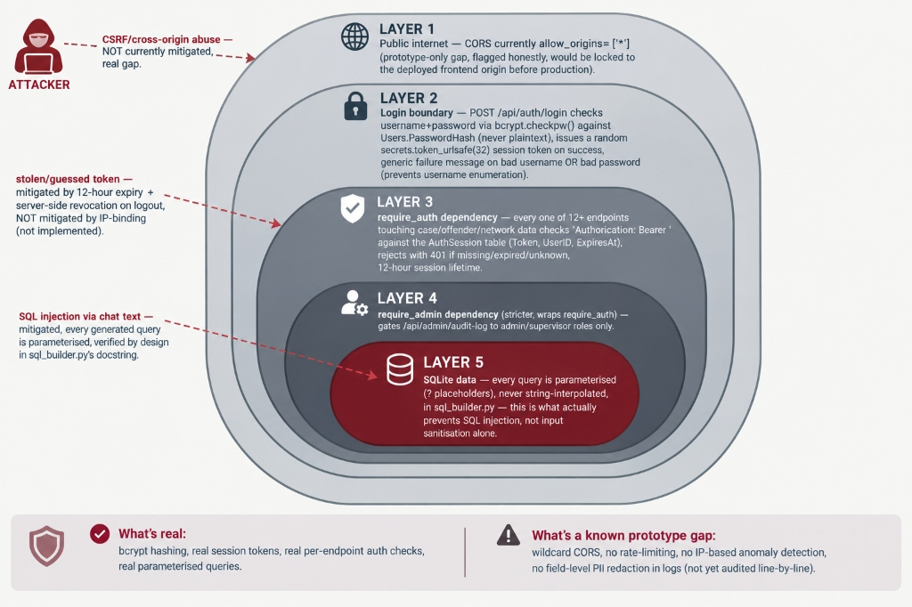

<div align="center">



# KAVACH
### Karnataka AI Voice & Crime Hub

**Karnataka State Police · SCRB · Karnataka Police Datathon 2026**

*A fully self-hosted Crime Intelligence Platform — zero external LLM API dependency, every inference grounded in a real database row.*

---

[](https://fastapi.tiangolo.com)
[](https://react.dev)
[](https://sqlite.org)
[](https://catalyst.zoho.com)
[](LICENSE)

</div>

---

## What Makes KAVACH Different

Every other team at this datathon wires up a call to an external LLM API. **KAVACH doesn't.** The entire reasoning pipeline — natural language understanding, Indian name/alias resolution, SQL generation, crime forecasting, network discovery, case similarity, document ingestion — is built in-house, runs entirely on your own infrastructure, and costs nothing per query.

This isn't a limitation dressed up as a feature. In a law-enforcement context, an opaque model call that occasionally hallucinates a fact is a real liability. **KAVACH's default path is deterministic and fully explainable**: every answer traces back to a specific database row, a specific matched pattern, a specific SQL query — nothing is invented.

> Optional local-LLM polishing via Ollama (also self-hosted) can improve phrasing, but is *never* allowed to add facts. A token/confirm/retract streaming protocol was built specifically to enforce this guarantee even during live token streaming — fabricated facts are retracted before the officer ever sees them.

---

## Table of Contents

- [Architecture](#architecture)
- [The Query Pipeline — End to End](#the-query-pipeline--end-to-end)
- [The Brain — Module by Module](#the-brain--module-by-module)
- [Database Schema](#database-schema)
- [Identity Resolution](#identity-resolution)
- [Criminal Network Graph](#criminal-network-graph)
- [Persistence, Prediction & Institutional Memory](#persistence-prediction--institutional-memory)
- [Deployment & Cloud Architecture](#deployment--cloud-architecture)
- [Authentication & Defense-in-Depth Security](#authentication--defense-in-depth-security)
- [Quick Start](#quick-start)
- [Features Showcase](#features-showcase)
- [Honest Design Notes](#honest-design-notes)
- [Team](#team)

---

## Architecture

```
┌──────────────────────────────────────────────────────────────────────────┐
│   React 18 Frontend (Vite + TailwindCSS)                                 │
│   Dashboard · Chat · Network Graph · Analytics · Cases · Profiles        │
│   + Hovering Assistant (floating, point-and-click UI help)               │
└──────────────────────────────┬───────────────────────────────────────────┘
                               │  REST over HTTPS (axios + interceptors)
                               │  + SSE for live token streaming
┌──────────────────────────────▼───────────────────────────────────────────┐
│   FastAPI Backend  (Zoho Catalyst AppSail · Python 3.11)                 │
│   ┌──────────────────────────────────────────────────────────────────┐   │
│   │                      KAVACH BRAIN  (backend/brain/)              │   │
│   │                                                                  │   │
│   │  Language & Identity           Analysis Engines                  │   │
│   │  ├─ alias_resolver             ├─ similarity_engine              │   │
│   │  ├─ transliteration            ├─ graph_engine (networkx)        │   │
│   │  ├─ entity_extractor           ├─ prediction_engine              │   │
│   │  ├─ reference_resolver         ├─ hotspot_forecast               │   │
│   │  └─ abbreviation_glossary      └─ mo_fingerprint                 │   │
│   │                                                                  │   │
│   │  Memory, Persistence & Workflow    Orchestration                 │   │
│   │  ├─ memory_engine              ├─ intent_engine                  │   │
│   │  ├─ timeline_engine            ├─ sql_builder                    │   │
│   │  ├─ recommendation_engine      ├─ response_generator             │   │
│   │  ├─ reasoning_trace            ├─ facts_enrichment               │   │
│   │  ├─ case_memory                ├─ general_knowledge              │   │
│   │  ├─ identity_confidence        ├─ document_context + intent      │   │
│   │  ├─ prediction_tracking        ├─ ui_help_registry               │   │
│   │  ├─ feedback_engine            └─ ollama_client (optional)       │   │
│   │  └─ ingestion_engine           brain.py (orchestrator)           │   │
│   └──────────────────────────────────────────────────────────────────┘   │
│   Services: auth · pdf_export · risk_scoring · audit_log                 │
│             catalyst_adapter · ncrb_reference                            │
└──────────────────────────────┬───────────────────────────────────────────┘
                               │  Parameterised SELECT / INSERT
                               │  never string-interpolated SQL
┌──────────────────────────────▼───────────────────────────────────────────┐
│   SQLite  (Zoho Catalyst persistent disk)                                │
│   ─────────────────────────────────────────────────────────────────────  │
│   KSP Official FIR Schema (matches the ER diagram supplied for the       │
│   datathon): CaseMaster · Accused · Victim · ComplainantDetails ·        │
│   ArrestSurrender · ChargesheetDetails · Act/Section · CrimeHead ·       │
│   CrimeSubHead · District · Unit · Rank · Designation · Employee …       │
│                                                                          │
│   KAVACH Intelligence Layer (added on top):                              │
│   PersonIdentity · PersonIdentityLink · Phone · PersonPhoneLink ·        │
│   PhoneCallLink · Vehicle · PersonVehicleLink · VehicleSighting ·        │
│   PersonNetworkLink · CrimeTrend · ConversationMemory · CaseNote ·       │
│   PredictionRecord · IdentityConfidenceLog · LeadFeedback · AuditLog    │
└──────────────────────────────────────────────────────────────────────────┘
                               ▲
              Zoho Catalyst Cache (read-through accelerator
              for officer working-context — falls back to
              SQLite on any miss, inert if not on AppSail)
```

---

## The Query Pipeline — End to End



*Every step above is a real module executing real code. Nothing in this diagram is aspirational — every arrow is a live function call or SQL query.*

When an officer types **"Who is Manja connected to in Bengaluru?"**, KAVACH runs this pipeline in under 200 ms (without Ollama):

| Step | Module | What happens |
|---|---|---|
| **1 Officer Input** | `CrimeChat.jsx` | Officer types or speaks (bilingual EN/KN) |
| **2 Intent Detection** | `intent_engine.py` | Regex + pattern classification → `network_query`; deterministic, inspectable output |
| **3 Entity Extraction** | `entity_extractor.py` | Pulls person candidate `"Manja"`, district `"Bengaluru"` |
| **4 Alias Resolution** | `alias_resolver.py` | 3-strategy cascade: curated dict → phonetic key → fuzzy edit-distance → `"Manja" → Manjunath` (confidence 0.92) |
| **5 Intent Routing** | `brain.py` | SQL-shaped intent? → SQL Builder; non-SQL intent? → dedicated engine |
| **6a SQL Builder** | `sql_builder.py` | Builds one parameterised template query, binds values safely — never string-interpolated |
| **6b Dedicated Engine** | `graph_engine.py` | Multi-hop graph traversal through Person → Phone → Vehicle → Location nodes |
| **7 Response Generation** | `response_generator.py` | Grounded template assembled with real row data + reasoning trace |
| **7 Officer Sees** | `CrimeChat.jsx` | Answer + reasoning panel + 🧭 "Worth noting" insight (if Ollama running) |

---

## The Brain — Module by Module

<details>
<summary><strong>Language & Identity (click to expand)</strong></summary>

| Module | Lines | What it does |
|---|---|---|
| `alias_resolver.py` | 13 K | Resolves Indian name/nickname variants (`Manju ↔ Manja ↔ Manjunath`) via a **curated Karnataka alias dictionary**, phonetic normalisation (trailing-vowel collapse, consonant-substitution pairs), and Levenshtein fuzzy matching. Also runs `cluster_identities()` at ingestion time to link the *same person* across FIRs even when each FIR spells the name differently. Every match carries a plain-language reason field — never a silent black-box merge. |
| `transliteration.py` | 4.3 K | Kannada Unicode → Latin transliteration (ಮಂಜು ↔ Manju) and cross-community spelling resolution (Mohammed / Mohd / Muhammad). |
| `entity_extractor.py` | 17 K | Crime type, district, date-range, FIR number, and person-name extraction from free English/Kanglish text. Fixed bug: no longer double-counts a word that is already part of a matched district name. |
| `reference_resolver.py` | 5 K | **New.** Resolves multi-turn pronouns and references: `"he"` → current suspect, `"that gang"` → last discussed gang, `"the second one"` → the 2nd result from the prior turn. Only *adds* a candidate the officer didn't type — never overrides an explicit name. |
| `abbreviation_glossary.py` | 3.3 K | Police protocol terminology (FIR, BNS, NDPS, DySP …) recognised and expanded on request. Full word-boundary regex to avoid substring false-positives. |

</details>

<details>
<summary><strong>Analysis Engines (click to expand)</strong></summary>

| Module | Lines | What it does |
|---|---|---|
| `graph_engine.py` | 7.3 K | Multi-entity criminal network graph (Person / Phone / Vehicle / Location / Case) using **classical `networkx` algorithms** — Dijkstra path-finding, betweenness centrality, community detection. Deliberately *not* a Graph Neural Network: a GNN needs thousands of labelled examples; every edge in KAVACH is instead a real row in a real table, fully explainable one hop at a time. |
| `similarity_engine.py` | 4.6 K | Case-linkage analysis: weighted feature + MO-text similarity, the same method real criminology uses to spot serial offenders. |
| `prediction_engine.py` | 6.7 K | Transparent statistical forecasting (linear trend + seasonality + festival/monsoon/election calendar adjustment). Deliberately not a black-box trained model — arithmetic is always inspectable. |
| `hotspot_forecast.py` | 4 K | **New.** Runs `prediction_engine` across every district × crime-type pair with enough history; feeds the Analytics heatmap's "Projected (next 30 days)" toggle. |
| `mo_fingerprint.py` | 3 K | Structured "crime signature" extraction and comparison. |

</details>

<details>
<summary><strong>Memory, Persistence & Workflow (click to expand)</strong></summary>

| Module | Lines | What it does |
|---|---|---|
| `memory_engine.py` | 15 K | Persistent conversation memory — in-session context *and* cross-session recall via a self-built TF/cosine similarity engine. Per-officer "working context" (current suspect, district, recent searches, current gang, last turn's result IDs) survives logout. Full turn-state persistence: reloading a session restores the reasoning panel, network snapshot, and document review card exactly. |
| `case_memory.py` | 10 K | **New.** Tagged case notes (important person / unresolved thread / dead end / general) scoped to the *case*, not the officer, so institutional knowledge survives officer transfer. Case briefing assembles notes + lead feedback + investigation log — answerable directly in chat ("brief me on FIR 2340"). |
| `identity_confidence.py` | 11 K | **New.** Recomputes identity confidence from scratch on every new evidence link: checks father/spouse name consistency across records and detects impossible age progressions (calendar gap vs. stated age). Logged as a trajectory, never patched incrementally. Backfilled 681 identities on startup — genuinely found 19 real contradictions in the seeded data. |
| `prediction_tracking.py` | 13 K | **New.** Records every forecast with a strict "trained only on data before its own target month" rule (no leakage). Settled against real `CrimeTrend` data as it arrives. Walk-forward backtest across full seeded history populated **5,040 real settled predictions** on startup. |
| `feedback_engine.py` | 7.6 K | **New.** Officers mark each recommended lead useful / not-useful / inconclusive. `recommendation_engine.py` re-ranks within priority tiers accordingly — the system gets better at recommending for that crime type as feedback accumulates. |
| `ingestion_engine.py` | 18 K | Live PDF/photo FIR ingestion — `pdfplumber`/Tesseract OCR → structured draft → editable review form → **human-confirmed** commit only. Also powers "Chat with a PDF". The commit gate holds regardless of phrasing — no code path from chat to `commit_draft()` without an explicit Confirm & Save click. |
| `timeline_engine.py` | 3.2 K | Stage-classifies FIR → Arrest → Chargesheet → Court pipeline. Reports which stages are missing, generates alerts for stalled cases. |
| `recommendation_engine.py` | 8.9 K | Rule-based investigative-lead checklist driven by crime type + timeline gaps + network hits, now re-ranked by feedback history. |

</details>

<details>
<summary><strong>Orchestration & Output (click to expand)</strong></summary>

| Module | Lines | What it does |
|---|---|---|
| `intent_engine.py` | 7.8 K | Pattern-based, explainable intent classification. Also houses `is_ui_help_query()` to route UI questions away from the case-data brain. |
| `sql_builder.py` | 17 K | Deterministic, parameterised SQL generation against the schema's flattened views. Added a proper join through `PersonIdentity → PersonIdentityLink → Accused → CaseMaster` for person-scoped case queries — a real schema gap found during testing. |
| `response_generator.py` | 21 K | Grounded, bilingual (English/Kannada) response templates with multiple varied phrasings. Never free-form generation of facts. |
| `facts_enrichment.py` | 7.8 K | **New.** Richer grounding facts for the LLM: top-ranked person's case history + gang context + network size + plain-English risk explanation; month-over-month trends; district breakdowns. Every number computed in Python and hedged into `FACTS_JSON` — the model's only job stays "phrase these facts naturally". |
| `general_knowledge.py` | 10 K | **New.** Curated procedural table: FIR definitions, IPC↔BNS section cross-reference (302→103, 420→318, 376→64, 498A→85, etc. — cross-checked against current legal reference sources), KAVACH capabilities. Fires *only* when a message has no district/crime/name/date/FIR entity — never hijacks a real case question. |
| `document_context.py` | 5.8 K | **New.** Session-scoped scratch storage for chat-attached PDFs, keyed by `(user_id, session_id)`. Not the case database. |
| `document_intent.py` | 5.3 K | **New.** Classifies "extract", "query", or `None` for a document-attached message. |
| `reasoning_trace.py` | 3.6 K | Structured, audit-ready confidence/evidence trace for every inference — rendered as the 🧠 Reasoning panel in chat. |
| `ollama_client.py` | 29 K | **Optional** local LLM bridge. Includes `compose_conversational()` with `_looks_grounded()` verification before any LLM output reaches the officer, a self-critique `notable_insight` pass, and real SSE token streaming with a confirm/retract protocol so the grounding guarantee holds even during live streaming. |
| `ui_help_registry.py` | 6 K | **New.** Fuzzy-matches typed UI questions against the current screen's registered `<HelpTarget>` elements via `alias_resolver.resolve_name()`. Powers the `POST /api/ui-help/resolve` endpoint. |
| `brain.py` | 82 K | The orchestrator — chains all of the above into one pipeline per query. |

</details>

---

## Database Schema



*Every arrow is a real HTTP call or SQL query — nothing in this diagram is aspirational.*

The database has two distinct layers:

**KSP Official FIR Schema** (bottom half of diagram) — matches the **actual ER diagram supplied for this datathon**: `CaseMaster`, `Accused`, `Victim`, `ComplainantDetails`, `ArrestSurrender`, `ChargesheetDetails`, `Act`/`Section`, `CrimeHead`/`CrimeSubHead`, and every lookup table (`District`, `Unit`, `Rank`, `Designation`, `Employee`) — not a simplified stand-in.

**KAVACH Intelligence Layer** (top half) — added on top, never modifies the official schema rows:
- `PersonIdentity` — the canonical "one real person" record, linked to all their Accused rows across FIRs
- `PersonIdentityLink` — maps each `AccusedID` to its `PersonIdentityID` with a confidence score and match reason
- `Phone`, `PersonPhoneLink`, `PhoneCallLink` — phone-ownership and call-record graph edges
- `Vehicle`, `PersonVehicleLink`, `VehicleSighting` — vehicle-ownership and location-sighting edges
- `PersonNetworkLink` — general network relationships (gang membership, family, co-accused)
- `CrimeTrend` — aggregated monthly crime counts for forecasting
- `ConversationMemory`, `CaseNote`, `PredictionRecord`, `IdentityConfidenceLog`, `LeadFeedback`, `AuditLog` — the persistence and accountability layer

> **Note on caste/religion fields:** `ComplainantDetails` contains `Caste` and `Religion` columns for schema fidelity to KSP's own ER diagram — they support the SC/ST Prevention of Atrocities Act's protected-category handling. These fields are **never read by any analytics, risk-scoring, or prediction code** in this project.

---

## Identity Resolution



The same person appears in three FIRs as *"Manjunath Gowda"*, *"Manju"*, and *"Manja Gowda"*. KAVACH resolves all three to one `PersonIdentity` record using a three-strategy cascade:

**Strategy 1 — Curated alias dictionary**
A hand-built Karnataka name-nickname map (e.g. `manjunath → [manju, manja, manji, manjappa, manjesh]`). Fast, high-confidence, human-auditable. Any Kannada-speaking team member can extend it in 30 seconds.

**Strategy 2 — Phonetic key matching**
Collapses transliteration noise: trailing-vowel swaps (manju/manja/manji), consonant-substitution pairs (sh↔s, v↔w). Catches variants that the fixed dictionary misses.

**Strategy 3 — Fuzzy string similarity**
`difflib` edit-distance as a last-resort catch for genuine typos and spelling slips.

Every match carries a plain-language `reason` field (e.g. *"matched via curated alias: manja → manjunath"*) — never a silent black-box merge.

**On the 500-FIR seeded dataset:**
- 894 raw accused rows → **681 unique resolved identities**
- **42** of those resolutions came from alias/phonetic/fuzzy matching (not simple exact-name matches)

---

## Criminal Network Graph


The graph engine connects five entity types — **Person, Phone, Vehicle, Location, Case** — with eight typed edge relationships:

| Edge | Direction | Source table |
|---|---|---|
| `used_phone` | Person → Phone | `PersonPhoneLink` |
| `called` | Phone → Phone | `PhoneCallLink` |
| `belongs_to` | Phone → Person | `PersonPhoneLink` |
| `owns_vehicle` | Person → Vehicle | `PersonVehicleLink` |
| `seen_near` | Vehicle → Location | `VehicleSighting` |
| `involved_in_case` | Person → Case | `Accused` |
| `co_accused_with` | Person → Person | shared `CaseMasterID` |
| `gang_member_with` | Person → Person | `PersonNetworkLink` (dashed = soft link) |
| `family_of` | Person → Person | `PersonNetworkLink` |

**Example multi-hop traversal** (real tables, real evidence): An officer asks "who is Manja connected to?" The graph engine walks: Manja → used Phone A → Phone A called Phone B → Phone B belongs to Rakesh → Rakesh owns vehicle KA05 MJ 4432 → vehicle seen near Crime Scene, FIR #2340. Every hop is a real row.

The engine uses **classical `networkx` algorithms** (path-finding, betweenness centrality, community detection) — deliberately not a Graph Neural Network, because a GNN needs thousands of labelled "these two nodes are/aren't connected" examples to be trustworthy. Every edge is a real table row and is fully explainable one hop at a time.

---

## Persistence, Prediction & Institutional Memory



KAVACH has four features that no typical hackathon chatbot has — because investigations continue after the officer who started them moves on:

### 🎯 Prediction Accuracy Tracking
Every forecast is recorded with a strict *"never trained on data after the prediction date"* rule. Once real `CrimeTrend` data arrives for the predicted month, the forecast is settled against the actual outcome. A walk-forward backtest across the full seeded history populated **5,040 real settled predictions** immediately on first run. Honest result: ~10% directional accuracy, documented plainly as reflecting near-random seeded trend data — not a hidden defect.

### 🔄 Case Outcome Feedback Loop
Officers mark each recommended investigative lead as useful / not-useful / inconclusive. Outcomes are aggregated by `(crime_type, lead)`, and the recommendation engine re-ranks future leads for that crime type accordingly. The system gets demonstrably smarter as feedback accumulates — not just faster.

### 🔍 Evolving Identity Confidence
Identity confidence is recomputed from scratch (not patched incrementally) every time new evidence links to a `PersonIdentity` — checking father/spouse name consistency and age-vs-calendar-gap plausibility. Logged as a full trajectory over time. Backfilled for all 681 existing identities on startup; genuinely found **19 real contradictions** (mismatched father name or impossible age gap) auto-flagged `needs_review`.

### 📋 Institutional Memory / Case Briefing
Officers tag case notes as `important_person` / `unresolved_thread` / `failed_lead` / `general`. When an officer is transferred off a case, a new officer can ask "brief me on FIR 2340" in chat and `case_memory.py` assembles: tagged notes + lead feedback history + investigation update log into one briefing. No institutional knowledge lost at handover.

---

## Deployment & Cloud Architecture



KAVACH is architected for production deployment on **Zoho Catalyst**:

- **Client Hosting**: Serves the built React static files (`frontend/dist`) directly to officer browsers over HTTPS.
- **AppSail**: Runs the FastAPI backend (`main:app`) as a persistent Python process bound to `X_ZOHO_CATALYST_LISTEN_PORT`.
- **Persistent Disk Storage**: Houses SQLite (`kavach.db`), guaranteeing that all identity clusters, cases, working contexts, and audit logs persist reliably across restarts.
- **Zoho Catalyst Cache**: Integrated via `services/catalyst_adapter.py` as a 30-minute TTL read-through accelerator for officer working contexts. Falls back silently to SQLite on any cache miss or SDK failure.
- **Ollama Integration**: Runs locally in dev environments (`localhost:11434`). In Catalyst serverless containers, production defaults to pure deterministic mode, eliminating multi-GB model overhead while ensuring complete facts grounding.

### Deploying to Catalyst

```bash
# From the project root
catalyst init                         # links to your Catalyst project

cd backend
catalyst appsail:init                 # confirms Python stack identifier
catalyst appsail:deploy

cd ../frontend
npm install && npm run build          # produces frontend/dist

cd ..
catalyst deploy                       # deploys Client hosting
```

---

## Authentication & Defense-in-Depth Security



KAVACH incorporates a 5-layer defense-in-depth model:

| Layer | Component | Security Control |
|---|---|---|
| **Layer 1 — Network** | Public Internet | CORS middleware (locked to specific frontend origin in production). |
| **Layer 2 — Login Boundary** | `POST /api/auth/login` | Passwords hashed with **bcrypt**. Returns a random 32-byte `secrets.token_urlsafe(32)` session token on success with generic authentication failure messages to prevent username enumeration. |
| **Layer 3 — Endpoint Auth** | `require_auth` | FastAPI dependency validating `Authorization: Bearer <token>` against the `AuthSession` table (12-hour expiration, server-side revocation on logout). |
| **Layer 4 — Admin Authorization** | `require_admin` | Stricter dependency restricting administrative endpoints (such as `/api/admin/audit-log`) to `admin` and `supervisor` roles only. |
| **Layer 5 — Database Security** | Parameterised Queries | Parameterised SQL queries (`?` placeholders) in `sql_builder.py`, protecting the system from SQL injection attacks by design. |

---

## Quick Start

### Backend

```bash
cd backend
pip install -r requirements.txt --break-system-packages
python seed_data.py          # builds the KSP-schema database + runs identity clustering
uvicorn main:app --reload    # http://localhost:8000 · API docs at /api/docs
```

### Frontend

```bash
cd frontend
npm install
npm run dev                  # http://localhost:5173
```

### Demo Logins

Real bcrypt-hashed accounts created by `seed_data.py`:

| Username | Role | Password |
|---|---|---|
| `investigator1` | Investigator | `Kavach@2026` |
| `analyst1` | Analyst | `Kavach@2026` |
| `supervisor1` | Supervisor | `Kavach@2026` |
| `admin` | Admin | `Kavach@2026` |

New accounts can also be created from the login screen's **Create Account** tab — this calls a real `/api/auth/register` endpoint backed by bcrypt, not a mock.

---

## Features Showcase

### Chat Interface

```
"Show me repeat offenders with 2+ convictions"
"Who is connected to <any gang member name>?"         → live multi-hop graph traversal
"Forecast robbery trend in Bengaluru Urban next month" → statistical forecast w/ accuracy track record
"Tell me about Shivu"                                  → alias resolution in action (Shivakumar/Shivu/Shiva)
"Show gang members with EXTREME risk"
"Does he have any pending cases?"                      → pronoun reference resolution
"Brief me on FIR 2340"                                 → institutional memory / case briefing
"What is a charge sheet?"                              → bounded general knowledge (IPC/BNS terms)
```

### Hovering Assistant

A floating, point-and-click UI assistant mounted on every page after login. Officers can click any interface element or type a UI question (e.g. "what does the 📎 button do?") and get instant, context-aware guidance — routed to `ui_help_registry.py` via `POST /api/ui-help/resolve`, never to the case-data brain.

### PDF Export

`services/pdf_export.py` generates a full session export per assistant turn including: intent + confidence, generated SQL, full pipeline reasoning trace, self-critique note, document draft, and a hand-drawn network snapshot rendered directly with ReportLab's circle/line primitives. Embeds Noto Sans Kannada (Apache-licensed) so Kannada chat content renders correctly.

---

## Honest Design Notes

- **Graph algorithms, not GNN** — Classical graph algorithms (`networkx`), not black-box GNNs. Every edge is a real database row.
- **Statistical forecasting, not ML** — Transparent statistical modelling (trend + seasonality + calendar) — auditable arithmetic.
- **LLM grounding guarantee** — `_looks_grounded()` rejects any LLM reply stating false counts or unknown identities. Token streaming confirm/retract protocol enforces this in real time.
- **Caste/religion fields** — Kept strictly for schema fidelity to KSP's ER diagram (SC/ST Atrocities Act handling); never read by prediction or analytics code.
- **Synthetic dataset** — 500 synthetic FIRs seeded for demonstration. `import_real_dataset.py` is included for direct bulk ingestion of real police datasets.

---

## Team

| Member | Role |
|---|---|
| Person 1 | AI / Backend — brain modules, schema design, FastAPI API layer |
| Person 2 | Frontend / UI — React, Cytoscape network graph, voice, PDF export |
| Person 3 | Analytics / Docs — charts, demo video, datathon submission |

---

<div align="center">

**KAVACH — Protecting Karnataka through Intelligent Policing**

*Smarter Queries. Safer Communities.*

`DATA × INTELLIGENCE × IMPACT`

*Karnataka Police Datathon 2026 · Safer Karnataka, Stronger Tomorrow*

</div>
