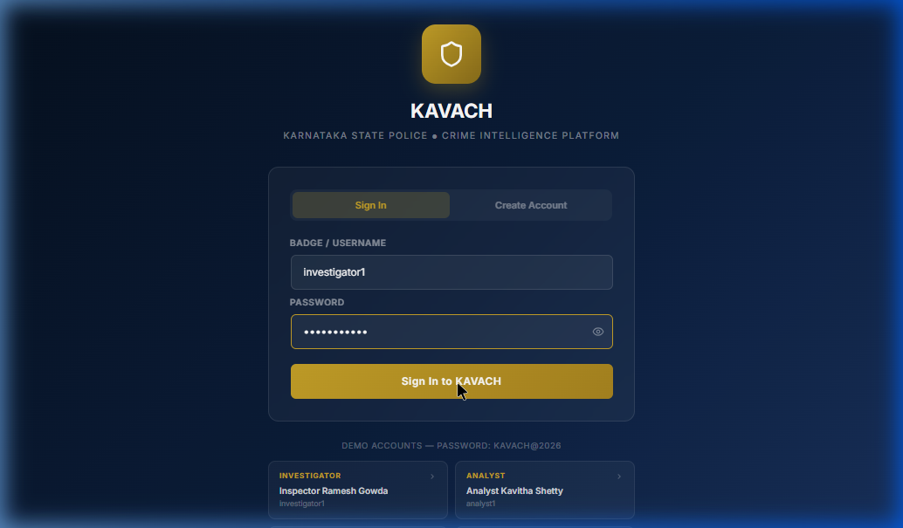
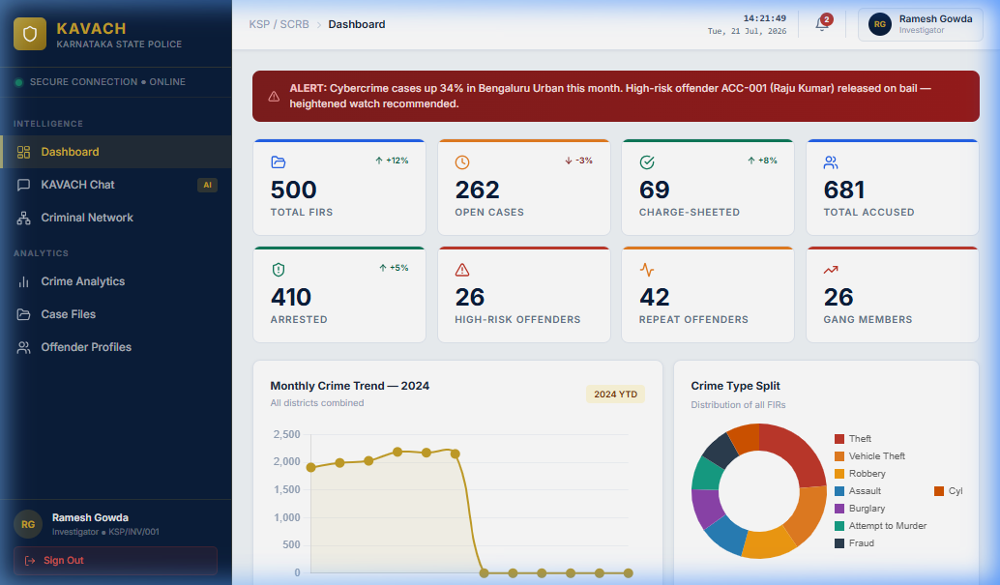

# KAVACH — Execution & Startup Report

The KAVACH — Karnataka AI Voice & Crime Hub application is now successfully running on your local machine. Below is a detailed summary of the current services and execution state.

---

## 🚀 Active Services

| Layer | Technology | Status | Access URL |
| :--- | :--- | :--- | :--- |
| **Backend API** | FastAPI / Python 3.13 | **Running** | [http://127.0.0.1:8000](http://127.0.0.1:8000) (API Docs: [docs](http://127.0.0.1:8000/docs)) |
| **Frontend UI** | React / Vite | **Running** | [http://localhost:5173](http://localhost:5173) |
| **Database** | SQLite (`kavach.db`) | **Seeded** | Located in `backend/kavach.db` |

---

## 📊 Database Seeding Status

The `seed_data.py` generator completed successfully and populated the database with a schema matching the official KSP FIR System ER diagram:

- **Cases (CaseMaster)**: `500`
- **Total Accused Persons**: `894`
- **Unique Resolved Identities**: `681` (with `42` cross-FIR alias/phonetic/fuzzy matching linkages resolved)
- **Gangs Identified**: `4` (linking `26` suspects)
- **Arrests / Custody Cases**: `410`
- **Chargesheets Filed**: `69`
- **Social Network Connections**: `86`
- **Phone / Vehicle nodes**: `712`
- **Investigation Updates**: `692` (stage-classified timeline events)
- **Historical Crime Trends**: `5,544` (used for predictive analytics)

---

## 🔐 Login Credentials (Bcrypt Hash Verified)

All seed accounts share the same password: **`Kavach@2026`**

- **Investigator**: `investigator1` (Profile: Ramesh Gowda)
- **Analyst**: `analyst1` (Profile: Kavitha Shetty)
- **Supervisor**: `supervisor1`
- **Admin**: `admin`

---

## 📸 Verified Views

A browser subagent verified both the login screen and the main dashboard to ensure it queries the API correctly.

### 1. Login Page
The login screen features high-fidelity, polished styling with preset demo logins for instant testing:

### 2. Crime Analytics Dashboard
After logging in, you are greeted with the dashboard showcasing live stats, real-time alerts, and crime frequency analysis charts:

---

> [!NOTE]
> The backend runs offline and does not require an active Gemini API Key. It defaults to deterministic keyword and template matching if none is provided. If you wish to use LLM parsing, create a `backend/.env` file with `GEMINI_API_KEY=your_key` and set `DEMO_MODE=false`.
